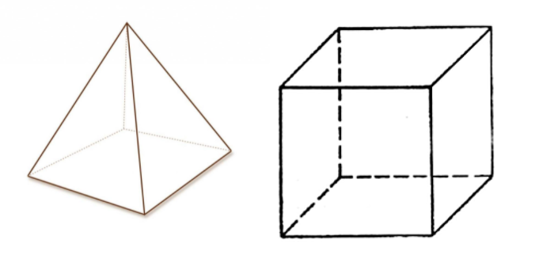

## Задача 3. Моделирование
### Что нужно сделать
В проекте по 3D-моделированию используются две фигуры — куб и пирамида. Для моделирования этих фигур используются соответствующие 2D-фигуры, а именно квадрат и треугольник. Вся поверхность 3D-фигуры может храниться в виде списка. Например, для куба это будет [Square, Square, Square, Square, Square, Square].

Квадрат инициализируется длинами сторон, а треугольник — основанием и высотой. Каждая из 2D-фигур умеет находить свои периметр и площадь, а 3D-фигуры, в свою очередь, могут находить площадь своей поверхности.

Используя входные данные о фигурах и знания математики, реализуйте соответствующие классы и методы. Для базовых классов также реализуйте геттеры и сеттеры. 
### Что оценивается
- Результат вычислений корректен.
- Модели реализованы в стиле ООП, основной функционал описан в методах классов и в отдельных функциях.
- При написании классов соблюдаются основные принципы ООП: инкапсуляция, наследование и полиморфизм.
  - Для получения и установки значений у приватных атрибутов используются сеттеры и геттеры с соответствующими декораторами.
  - Для создания нового класса на основе уже существующего используется наследование.
  - Для статических и классовых методов используется декоратор `classmethod`.
- Сообщения о процессе получения результата осмысленны и понятны для пользователя.
- Переменные, функции и собственные методы классов имеют значащие имена, не `a`, `b`, `c`, `d`.
- Классы и методы/функции имеют прописанную документацию.
- Есть аннотация типов для методов/функций и их аргументов (кроме `args` и `kwargs`). Если функция/метод ничего не возвращают, то используется `None`.

